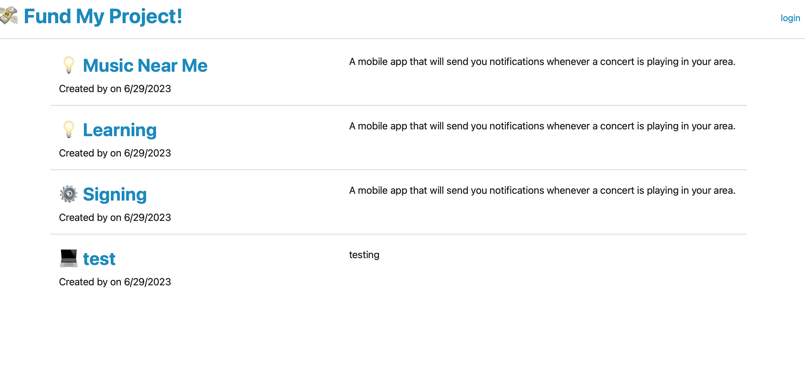

# techBlog

Deployed Application

To see the application in action, check out this https://agile-wildwood-74766-1b8b21eed2e6.herokuapp.com

Table of Contents

Installation
Usage
Features
Technologies
Contributing
License
Questions
Installation

Clone the repository to your local machine.
Install the required dependencies by running the following command:
npm install
Set up the database by executing the SQL script in the db/schema.sql file.
Configure the database connection by adding your credentials in the .env file.
Optionally, seed the database with sample data by running the following command:
npm run seed
Usage

Start the application by running the following command:
npm start
Open your web browser and visit http://localhost:3001 to access the Tech Blog.
Features

User authentication: Sign up, sign in, and sign out functionalities.
User authorization: Only logged-in users can create, update, and delete their own blog posts.
Homepage: Displays existing blog posts with titles and creation dates.
Blog post detail page: Shows the title, contents, creator's username, and creation date. Allows users to leave comments.
Dashboard: Displays the user's own blog posts and provides options to add new posts or update/delete existing posts.
Comment functionality: Users can leave comments on blog posts, which are displayed with the comment creator's username and creation date.
Technologies

Node.js
Express.js
Sequelize ORM
Handlebars.js
MySQL
HTML/CSS
Contributing

Contributions are welcome! If you find any issues or have suggestions for improvement, please create a new issue or submit a pull request.

License

This project is licensed under the MIT License.

Questions

If you have any questions, feel free to reach out:

GitHub: ShahnazAfreen9849
Email: williamshahnaz818@gmail.com